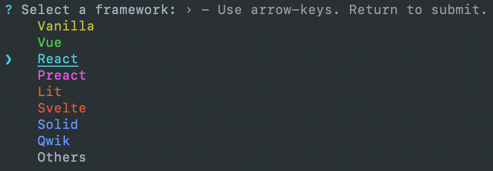
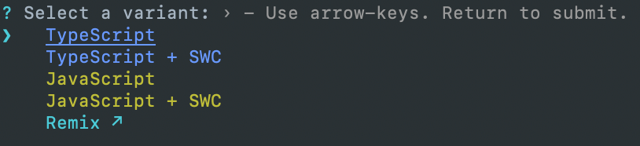
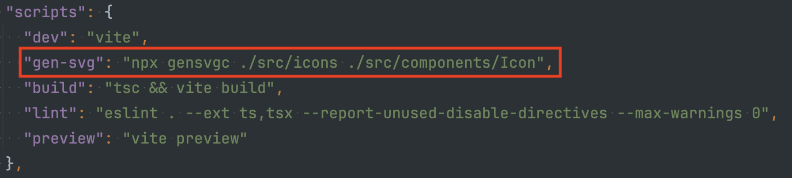

# 📚Generation react / react-native icon component

[](https://www.npmjs.com/package/gensvgc)

#### Generate function with import svg's and (react/react-native) Icon component using folder. Just specify the path to the icons and the path where to generate the component, and the package will do everything for you!

## Installation

Npm:
```bash
npm install -D gensvgc
```

Yarn:
```bash
yarn add -D gensvgc
```

## Usage

Run this command:
```bash
npx gensvgc icons
```

#### The only first required argument is the directory where all svg files are located. 
#### The second argument is the directory where the component will be created.

## Example flow

Let's take for example a project on vite.

### 1. Initialize project:

```bash
npx create vite my-vue-app
```

#### Select react:



#### Select typescript:



### 2. Next, since we are using vite we need to install `vite-plugin-svgr` so that svg can be imported as components:

```bash
npm i -D vite-plugin-svgr
```

And add package to `vite.config.js`

### 3. Next, we install the gensvgc package:

```bash
npm i -D gensvgc
```

### 4. For ease of use, let's add a `.gensvgcrc.json` configuration file to the root of the project with the following parameters:

```json
{
  "watch": false,
  "typescript": true,
  "dynamic": true
}
```

### 5. The last step is to add the command to `package.json`:



Now when you run the command, a ready component with full typescript will appear:

```tsx
import React from "react";


import { getSvgComponent, SvgComponentType, SvgIconsType } from "./__generated__/dynamic-adapter.ts";

export type IconsType = SvgIconsType;

export interface IconProps extends React.SVGProps<SVGSVGElement> {
  name: IconsType;
}

export const Icon: React.FC<IconProps> = ({ name, ...props }) => {
  const [IconComponent, setIconComponent] = React.useState<SvgComponentType>(null);

  React.useEffect(() => {
    getSvgComponent(name).then(res => setIconComponent(res));
  }, [name]);

  if (IconComponent) {
    return <IconComponent.default {...props} />;
  }

  return <></>;
};
```

And a special function with import:

```ts
export type SvgIconsType = "react" | "vite";
export type SvgComponentType = typeof import("*.svg?react") | null;

export const getSvgComponent = async (
  name: SvgIconsType,
): Promise<SvgComponentType> => {
  let svgComponent = null;

  switch (name) {
    case "react":
      svgComponent = await import("../../../icons/react.svg?react");
      break;
    case "vite":
      svgComponent = await import("../../../icons/vite.svg?react");
      break;
    default:
      break;
  }

  return svgComponent;
};
```

That's all there is to it :confetti_ball:

## CLI Options

For all possible commands, run `npx gensvgc --help`.

### `--watch` (`-w`)

- **Type**: `boolean`
- **Default**: `false`
- **Example**: `npx gensvgc icons --watch`

> Keep track of adding / changing / deleting files. Nesting is also supported.

---

### `--template` (`-t`)

- **Type**: `string`
- **Default**: `undefined`
- **Example**: `npx gensvgc icons --template=./src/fragments/react.template`

> The path to the template to be used when generating the component. In the template, you need to specify the snippets that will be automatically replaced with code pieces, depending on your build environment (Next.js/Vite/Cra/React-Native).
> <br> 
> The .template extension is used, but in general you can use any file extension.

#### Typescript template example with dynamic svg import:
```ts
{nextUseClient}
import React from "react";
{rnTypesImport}

{svgTypesAndComponentImports}

export type IconsType = {svgIconsType};

export interface IconProps extends {extendType} {
  name: IconsType;
}

export const Icon: React.FC<IconProps> = ({ name, ...props }) => {
  const [IconComponent, setIconComponent] = React.useState<SvgComponentType>(null);

  React.useEffect(() => {
    getSvgComponent(name).then(res => setIconComponent(res));
  }, [name]);

  if (IconComponent) {
    return <IconComponent.default {...props} />;
  }

  return <></>;
};
```

You can also see the defaults ones that are used in the package:
`templates/component/*`

---

### `--dynamic` (`-d`)

- **Type**: `boolean`
- **Default**: `false`
- **Example**: `npx gensvgc icons --dynamic`

> Generate component with dynamic load svg files.
> What is meant by dynamic loading is that the svg icons will only be imported as needed.

---

### `--typescript`

- **Type**: `boolean`
- **Default**: `false`
- **Example**: `npx gensvgc icons --typescript`

> Generating import function and component using typescript.

---

### `--after` (`-a`)

- **Type**: `string`
- **Default**: `undefined`
- **Example**: `npx gensvgc icons --after="npm run lint:fix""`

> After generation, you can call your custom command, for example for linting files.


---

### `--nameFileComp` (`-n`)

- **Type**: `string`
- **Default**: `Icon`
- **Example**: `npx gensvgc icons --nameFileComp="MyIcon"`

> After generation, you can call your custom command, for example for linting files.


---

### `--skipInitial` (`-s`)

- **Type**: `boolean`
- **Default**: `false`
- **Example**: `npx gensvgc icons --skipInitial`

> Skips initial generation (if you use the `--watch` flag).

## Config options

#### You can use any of these popular config formats:

- `.gensvgcrc.json`
- `.gensvgcrc.yaml`
- `.gensvgcrc.yml`
- `gensvgc.config.js`
- `.gensvgcrc.js`
- `gensvgc.config.mjs`
- `.gensvgcrc.mjs`
- `gensvgc.config.ts`
- `.gensvgcrc.ts`
- `.gensvgcrc.cjs`
- `gensvgc.config.cjs`


## License

MIT Licensed. Copyright (c) Victor Razdorov 2024.
